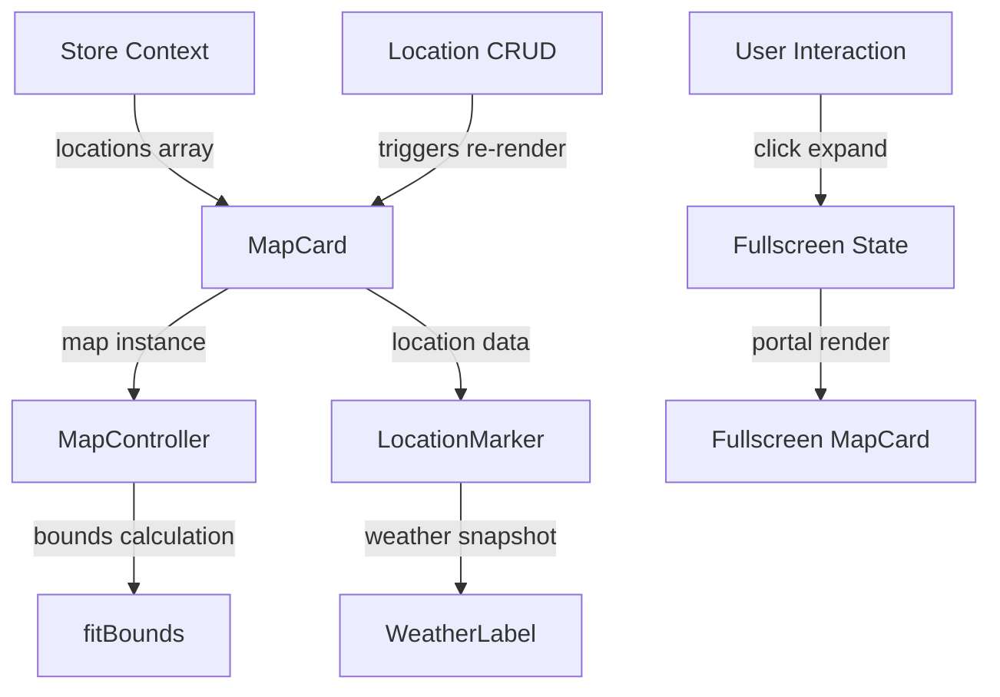

# Design Document: Weather Map Card

## Overview

This design specifies the implementation of an Apple Weather-style map card component for the Weather Starter application. The map card displays all saved locations as interactive pins with weather labels overlaid on an OpenStreetMap-based map. Users can expand the map to fullscreen for detailed exploration while maintaining seamless integration with the existing location management system.

### Key Features

- **Embedded Map Card**: Displays in the dashboard alongside existing weather cards
- **Location Pins**: Visual markers for each saved location with weather data overlays
- **Fullscreen Expansion**: Smooth transition to fullscreen view with preserved map state
- **Responsive Design**: Adapts to mobile and desktop viewports
- **Real-time Updates**: Automatically reflects location additions, deletions, and weather refreshes

### Technology Stack

- **React Leaflet 4.x**: React bindings for Leaflet mapping library
- **Leaflet 1.9.x**: Core mapping functionality (already in dependencies)
- **OpenStreetMap**: Tile provider for map rendering
- **TypeScript**: Type-safe component implementation
- **Tailwind CSS**: Styling consistent with existing components

## Architecture

### Component Hierarchy

```
Hero (modified)
├── MapCard
│   ├── MapContainer (React Leaflet)
│   │   ├── TileLayer
│   │   ├── LocationMarker (for each location)
│   │   │   └── WeatherLabel
│   │   └── MapController (custom hook)
│   └── ExpandButton
└── (existing components)
```

### Data Flow



### State Management

The MapCard component will integrate with the existing Zustand store (`useStore` hook) to:
- Subscribe to `locations` array for pin rendering
- Subscribe to `selectedId` for highlighting selected location
- React to location additions/deletions for automatic bounds adjustment

**Local Component State**:
- `isFullscreen: boolean` - Controls fullscreen mode
- `mapInstance: Map | null` - Reference to Leaflet map instance for programmatic control

## Components and Interfaces

### MapCard Component

**Purpose**: Main container component that renders the map card in the dashboard and manages fullscreen state.

**Props**: None (uses store context)

**State**:
```typescript
interface MapCardState {
  isFullscreen: boolean;
  mapInstance: Map | null;
  isTransitioning: boolean;
}
```

**Responsibilities**:
- Render map container with OpenStreetMap tiles
- Manage fullscreen state transitions
- Render expand/close buttons
- Handle keyboard events (Escape key)
- Clean up map resources on unmount

**Integration Point**: Rendered in `Hero.tsx` after the header section, before `HourlyStrip`.

### LocationMarker Component

**Purpose**: Renders a single location pin with weather label on the map.

**Props**:
```typescript
interface LocationMarkerProps {
  location: Location;
  isSelected: boolean;
  onMarkerClick: (locationId: number) => void;
}
```

**Responsibilities**:
- Render Leaflet marker at location coordinates
- Display WeatherLabel component above pin
- Handle click events to highlight corresponding dashboard card
- Apply visual highlight when selected

**Marker Styling**:
- Default: Blue pin with white border
- Selected: Blue pin with thicker border and 1.2x scale
- Transition: 200ms ease-in-out

### WeatherLabel Component

**Purpose**: Displays weather information above a location pin.

**Props**:
```typescript
interface WeatherLabelProps {
  weather: WeatherSnapshot;
  position: 'above' | 'below'; // for collision avoidance
}
```

**Responsibilities**:
- Display temperature (if available) or condition text
- Render with semi-transparent background
- Handle label collision detection and repositioning
- Maintain 4.5:1 contrast ratio

**Label Format**:
- Temperature available: `"{temp}°C"` (e.g., "28°C")
- Temperature unavailable: `"{condition}"` (e.g., "Partly Cloudy")
- No data: `"--"`

**Styling**:
- Font size: 12px
- Background: `rgba(0, 0, 0, 0.8)` with white text
- Padding: 4px 8px
- Border radius: 6px
- Position: 20px above pin center

### MapController Hook

**Purpose**: Custom hook that manages map instance lifecycle and automatic bounds adjustment.

**Interface**:
```typescript
function useMapController(
  mapInstance: Map | null,
  locations: Location[],
  isFullscreen: boolean
): void
```

**Responsibilities**:
- Initialize map with default center (Singapore: 1.3521°N, 103.8198°E) and zoom level 11
- Calculate bounds to fit all location pins with 50px padding
- Trigger `fitBounds` when locations array changes
- Debounce bounds updates to avoid excessive re-renders (500ms)
- Preserve map state during fullscreen transitions

**Bounds Calculation Algorithm**:
```typescript
function calculateBounds(locations: Location[]): LatLngBounds | null {
  if (locations.length === 0) return null;
  
  const validLocations = locations.filter(
    loc => loc.latitude >= -90 && loc.latitude <= 90 &&
           loc.longitude >= -180 && loc.longitude <= 180
  );
  
  if (validLocations.length === 0) return null;
  
  const bounds = L.latLngBounds(
    validLocations.map(loc => [loc.latitude, loc.longitude])
  );
  
  return bounds;
}
```

### FullscreenPortal Component

**Purpose**: Renders the fullscreen map view using React Portal.

**Props**:
```typescript
interface FullscreenPortalProps {
  isOpen: boolean;
  onClose: () => void;
  children: ReactNode;
}
```

**Responsibilities**:
- Render children into document body using `createPortal`
- Apply fullscreen overlay styles
- Handle close button clicks
- Handle Escape key press
- Prevent body scroll when open

## Data Models

### Extended Location Type

The existing `Location` interface already contains all necessary data:

```typescript
interface Location {
  id: number;
  latitude: number;
  longitude: number;
  created_at: string;
  weather: WeatherSnapshot;
}
```

**Validation Rules**:
- `latitude`: Must be in range [-90, 90]
- `longitude`: Must be in range [-180, 180]
- Invalid coordinates: Log error, skip pin rendering

### Map Configuration

```typescript
interface MapConfig {
  defaultCenter: [number, number]; // [1.3521, 103.8198]
  defaultZoom: number; // 11
  minZoom: number; // 1
  maxZoom: number; // 18
  tileUrl: string; // 'https://tile.openstreetmap.org/{z}/{x}/{y}.png'
  tileAttribution: string; // '© OpenStreetMap contributors'
  boundsOptions: {
    padding: [number, number]; // [50, 50]
    maxZoom: number; // 15
    animate: boolean; // true
    duration: number; // 0.5 (seconds)
  };
}
```

### Fullscreen State

```typescript
interface FullscreenState {
  isFullscreen: boolean;
  isTransitioning: boolean;
  preservedCenter: LatLng | null;
  preservedZoom: number | null;
}
```

## Error Handling

### Map Initialization Errors

**Scenario**: Leaflet fails to initialize within 2 seconds

**Handling**:
```typescript
try {
  // Map initialization
} catch (error) {
  console.error('Map initialization failed:', error);
  return (
    <div className="error-state">
      Unable to load map. Please refresh the page.
    </div>
  );
}
```

### Tile Loading Errors

**Scenario**: OpenStreetMap tiles fail to load after 3 retries (10s timeout each)

**Handling**:
- Display error message: "Map tiles unavailable. Please check your connection."
- Render gray placeholder tiles with "Tile unavailable" text
- Allow continued interaction with loaded tiles

**Implementation**:
```typescript
<TileLayer
  url="https://tile.openstreetmap.org/{z}/{x}/{y}.png"
  attribution='&copy; <a href="https://www.openstreetmap.org/copyright">OpenStreetMap</a> contributors'
  errorTileUrl="data:image/svg+xml,..." // Gray placeholder SVG
  maxNativeZoom={18}
  maxZoom={18}
/>
```

### Invalid Coordinates

**Scenario**: Location has latitude outside [-90, 90] or longitude outside [-180, 180]

**Handling**:
```typescript
function validateCoordinates(location: Location): boolean {
  const { latitude, longitude } = location;
  
  if (latitude < -90 || latitude > 90 || longitude < -180 || longitude > 180) {
    console.error(`Invalid coordinates for location ${location.id}:`, {
      latitude,
      longitude
    });
    return false;
  }
  
  return true;
}
```

### Label Collision Detection

**Scenario**: Two or more weather labels overlap (separation < 30px)

**Handling**:
- Calculate pixel distance between label positions
- Apply vertical offset to overlapping labels
- Offset amount: 30px increments
- Maximum 3 labels stacked vertically

**Algorithm**:
```typescript
function resolveCollisions(labels: LabelPosition[]): LabelPosition[] {
  const sorted = labels.sort((a, b) => a.y - b.y);
  const resolved: LabelPosition[] = [];
  
  for (const label of sorted) {
    let offset = 0;
    while (hasCollision(label, resolved, offset)) {
      offset += 30;
      if (offset > 90) break; // Max 3 stacks
    }
    resolved.push({ ...label, y: label.y - offset });
  }
  
  return resolved;
}
```

### Transition State Conflicts

**Scenario**: User clicks expand/close button while transition is in progress

**Handling**:
- Set `isTransitioning` flag during animation
- Ignore button clicks when `isTransitioning === true`
- Clear flag after 500ms (transition duration)

## Correctness Properties

**Property-based testing is not applicable to this feature.**

This feature primarily involves:
- **UI rendering and layout** (map card display, pins, labels, fullscreen transitions)
- **External library integration** (React Leaflet, OpenStreetMap tile loading)
- **User interaction handling** (click, drag, zoom, keyboard events)
- **Visual presentation** (styling, positioning, animations)

According to the property-based testing guidelines, PBT is not appropriate for:
- UI rendering and layout (use snapshot/visual regression tests instead)
- External library integration (use integration tests)
- User interaction handling (use example-based tests)

The acceptance criteria specify concrete behaviors (e.g., "transition within 500ms", "position 20px above pin") that are best validated through example-based tests with specific inputs rather than universal properties across randomized inputs.

**No correctness properties are defined for this feature.** Testing will rely on unit tests, integration tests, and manual testing as described in the Testing Strategy section below.

## Testing Strategy

### Unit Tests

**Framework**: Vitest (existing in project)

**Test Coverage**:

1. **MapCard Component**
   - Renders with default center and zoom when no locations exist
   - Displays "No locations saved yet" message when locations array is empty
   - Renders LocationMarker for each valid location
   - Skips rendering for locations with invalid coordinates
   - Calls fitBounds when locations array changes
   - Toggles fullscreen state on expand button click
   - Exits fullscreen on Escape key press
   - Ignores button clicks during transitions

2. **LocationMarker Component**
   - Renders marker at correct latitude/longitude
   - Displays WeatherLabel with temperature when available
   - Displays WeatherLabel with condition when temperature unavailable
   - Displays "--" when no weather data available
   - Calls onMarkerClick with location ID on click
   - Applies selected styling when isSelected is true

3. **MapController Hook**
   - Initializes map with default center and zoom
   - Calculates bounds for single location
   - Calculates bounds for multiple locations
   - Returns null bounds for empty locations array
   - Filters out invalid coordinates
   - Debounces fitBounds calls (500ms)
   - Preserves center and zoom during fullscreen transition

4. **Coordinate Validation**
   - Accepts valid latitude in range [-90, 90]
   - Accepts valid longitude in range [-180, 180]
   - Rejects latitude outside range
   - Rejects longitude outside range
   - Logs error for invalid coordinates

5. **Label Collision Detection**
   - Detects collision when labels are < 30px apart
   - Applies 30px vertical offset to second label
   - Stacks up to 3 labels with 30px increments
   - Stops stacking after 90px offset

### Integration Tests

1. **Location Addition Flow**
   - Add location via form
   - Verify new pin appears on map within 500ms
   - Verify map bounds adjust to include new pin
   - Verify weather label displays correct data

2. **Location Deletion Flow**
   - Delete location from sidebar
   - Verify pin removes from map within 500ms
   - Verify map bounds adjust to remaining pins

3. **Fullscreen Transition**
   - Click expand button
   - Verify map transitions to fullscreen within 500ms
   - Verify center and zoom preserved
   - Verify all pins and labels visible
   - Click close button
   - Verify map returns to card view within 500ms
   - Verify center and zoom preserved

4. **Responsive Behavior**
   - Resize viewport to mobile width (< 768px)
   - Verify map card height adjusts to 300px
   - Resize viewport to desktop width (>= 768px)
   - Verify map card height adjusts to 400px

### Manual Testing Checklist

- [ ] Map loads with default center (Singapore) when no locations exist
- [ ] Pins appear for all saved locations
- [ ] Weather labels display correct temperature or condition
- [ ] Clicking pin highlights corresponding dashboard card
- [ ] Map pans and zooms smoothly
- [ ] Expand button opens fullscreen view
- [ ] Close button exits fullscreen view
- [ ] Escape key exits fullscreen view
- [ ] Map state preserved during fullscreen transitions
- [ ] Responsive layout works on mobile and desktop
- [ ] Error message displays when map fails to load
- [ ] Gray placeholder tiles display when tiles fail to load

### Accessibility Testing

- [ ] Expand button has accessible label
- [ ] Close button has accessible label
- [ ] Keyboard navigation works (Tab, Enter, Escape)
- [ ] Screen reader announces map card and controls
- [ ] Weather labels have 4.5:1 contrast ratio
- [ ] Focus indicators visible on interactive elements

## Implementation Notes

### React Leaflet Setup

React Leaflet requires CSS imports for proper styling:

```typescript
// In MapCard.tsx or main.tsx
import 'leaflet/dist/leaflet.css';
```

### Custom Marker Icons

Leaflet's default marker icon paths may not resolve correctly in Vite. Fix by setting icon defaults:

```typescript
import L from 'leaflet';
import icon from 'leaflet/dist/images/marker-icon.png';
import iconShadow from 'leaflet/dist/images/marker-shadow.png';

const DefaultIcon = L.icon({
  iconUrl: icon,
  shadowUrl: iconShadow,
  iconSize: [25, 41],
  iconAnchor: [12, 41],
});

L.Marker.prototype.options.icon = DefaultIcon;
```

### Fullscreen Portal Implementation

Use React's `createPortal` to render fullscreen view:

```typescript
import { createPortal } from 'react-dom';

function FullscreenPortal({ isOpen, onClose, children }: FullscreenPortalProps) {
  useEffect(() => {
    if (isOpen) {
      document.body.style.overflow = 'hidden';
    }
    return () => {
      document.body.style.overflow = '';
    };
  }, [isOpen]);

  if (!isOpen) return null;

  return createPortal(
    <div className="fixed inset-0 z-50 bg-black">
      {children}
    </div>,
    document.body
  );
}
```

### Map Instance Management

Store map instance in ref to avoid re-renders:

```typescript
const mapRef = useRef<Map | null>(null);

<MapContainer
  ref={mapRef}
  center={defaultCenter}
  zoom={defaultZoom}
  // ...
>
```

### Debounced Bounds Updates

Use debounce to avoid excessive fitBounds calls:

```typescript
const debouncedFitBounds = useMemo(
  () => debounce((bounds: LatLngBounds) => {
    if (mapRef.current) {
      mapRef.current.fitBounds(bounds, {
        padding: [50, 50],
        maxZoom: 15,
        animate: true,
        duration: 0.5,
      });
    }
  }, 500),
  []
);
```

### TypeScript Types

Install type definitions:

```bash
npm install --save-dev @types/leaflet
```

The `react-leaflet` package includes its own TypeScript definitions.

### Styling Consistency

Match existing card styling from `Tiles.tsx`:

```typescript
className="rounded-2xl border border-white/15 bg-white/[0.08] backdrop-blur-xl"
```

### Performance Considerations

- **Marker Clustering**: Not required for initial implementation (typical use case: < 10 locations)
- **Tile Caching**: Handled automatically by Leaflet
- **Re-render Optimization**: Use `React.memo` for LocationMarker components
- **Map Instance Reuse**: Preserve single map instance across fullscreen transitions

### Hero Component Integration

Add MapCard after the header section in `Hero.tsx`:

```typescript
<header className="flex flex-col items-center pt-6 pb-2 text-center">
  {/* existing header content */}
</header>

{validPeriod && (
  <p className="px-2 pb-1 text-center text-xs text-white/65">{validPeriod}</p>
)}

<MapCard /> {/* NEW */}

<HourlyStrip periods={selected.weather?.forecast_periods} />
```

### Z-Index Management

Ensure proper layering:
- Map card: `z-0` (default)
- Fullscreen overlay: `z-50`
- Weather labels: `z-1000` (Leaflet default for popups)
- Expand/close buttons: `z-10` (relative to card/fullscreen container)

### Mobile Touch Handling

Leaflet handles touch events automatically. Ensure:
- Pinch-to-zoom enabled (default)
- Drag-to-pan enabled (default)
- Double-tap-to-zoom enabled (default)

### Error Boundary

Wrap MapCard in error boundary to prevent full app crash:

```typescript
<ErrorBoundary fallback={<MapErrorFallback />}>
  <MapCard />
</ErrorBoundary>
```

## Future Enhancements

- **Marker Clustering**: Group nearby pins when zoomed out
- **Custom Pin Icons**: Weather-specific icons (sun, cloud, rain)
- **Pin Animations**: Bounce effect when location added
- **Weather Overlays**: Temperature heatmap, precipitation radar
- **Geolocation**: Center map on user's current location
- **Offline Support**: Cache tiles for offline viewing
- **3D Terrain**: Elevation data visualization
- **Dark Mode**: Alternative tile layer for dark theme
