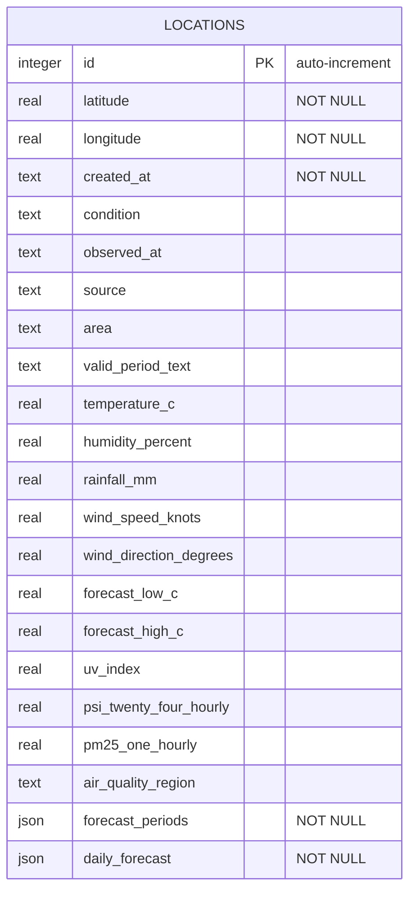
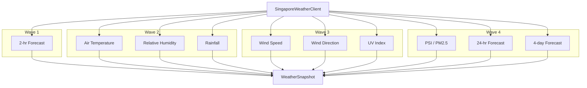

The backend is an Express application that serves both the API endpoints and the frontend SPA (via Vite middleware in development, static files in production).

## Server Setup

```mermaid
graph LR
  subgraph Express
    Pino[Pino HTTP Logger]
    JSON[JSON Body Parser]
    Health[GET /health]
    Logs[POST /api/logs]
    Locations[/api/locations routes]
    Areas[/api/areas routes]
    Vite[Vite Middleware / Static]
    Errors[Error Handler]
  end

  Pino --> JSON --> Health
  JSON --> Logs
  JSON --> Locations
  JSON --> Areas
  JSON --> Vite
  Vite --> Errors
```

Key features of `server.ts`:

- Pino HTTP request logging (disabled in test mode)
- JSON body parsing for all routes except `/frontman`
- Health check at `GET /health`
- Frontend event logging at `POST /api/logs`
- Vite middleware in development, static serving in production
- Global error handler returns `500` with structured error

## Database Layer

SQLite with WAL mode and Drizzle ORM (sqlite-proxy adapter). The database auto-migrates on startup.

### Schema

A single `locations` table stores both coordinates and a flattened weather snapshot:



A unique index on `(latitude, longitude)` prevents duplicate locations.

### Data Access Functions

| Function | Description |
|----------|-------------|
| `listLocations()` | All locations ordered by newest first |
| `createLocation(lat, lon)` | Insert with default "not refreshed" weather |
| `getLocation(id)` | Single location by ID |
| `updateWeather(id, snapshot)` | Overwrite weather columns |
| `deleteLocation(id)` | Remove a location |
| `resetStore()` | Clear all data (for testing/dev) |

## Weather Client

The `SingaporeWeatherClient` class fetches from multiple data.gov.sg endpoints and aggregates the results into a single `WeatherSnapshot`.



### Features

- **Nearest station matching:** Uses Haversine distance to find the closest weather station or forecast area for a given coordinate
- **Batched requests:** Endpoints are called in waves to stay within rate limits (~5 req/sec)
- **Retry logic:** Exponential backoff on failures and 429 responses
- **Graceful degradation:** Individual data source failures don't block the entire snapshot — missing fields are returned as `null`

## API Endpoints

| Method | Path | Description |
|--------|------|-------------|
| `GET` | `/health` | Health check |
| `POST` | `/api/logs` | Frontend event logging |
| `GET` | `/api/locations` | List all locations |
| `POST` | `/api/locations` | Create location (auto-refreshes weather) |
| `GET` | `/api/locations/:id` | Get single location |
| `DELETE` | `/api/locations/:id` | Delete location |
| `POST` | `/api/locations/:id/refresh` | Refresh weather (60s cooldown) |
| `GET` | `/api/areas` | Fetch Singapore area metadata |

### Validation Rules

- Coordinates must be within Singapore bounds: lat `1.1–1.5`, lon `103.6–104.1`
- Duplicate `(latitude, longitude)` pairs return `409 Conflict`
- Refresh has a per-location 60-second cooldown (returns `429` if too frequent)
- Invalid location IDs return `400`
