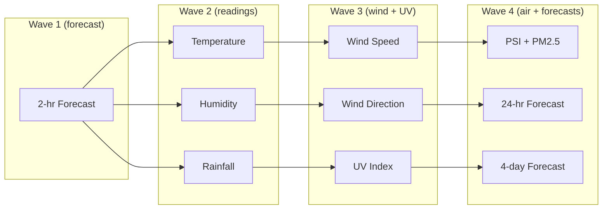

Weather data is sourced from Singapore's [data.gov.sg](https://data.gov.sg) open data platform. The `SingaporeWeatherClient` class aggregates data from multiple endpoints into a unified `WeatherSnapshot`.

## API Endpoints

### Real-Time Readings (v2)

Base URL: `https://api-open.data.gov.sg/v2/real-time/api`

| Endpoint | Data |
|----------|------|
| `/two-hr-forecast` | Primary forecast with area metadata |
| `/air-temperature` | Temperature readings from stations |
| `/relative-humidity` | Humidity readings |
| `/rainfall` | Rainfall in mm |
| `/wind-speed` | Wind speed in knots |
| `/wind-direction` | Wind direction in degrees |

### Forecasts (v1)

Base URL: `https://api-open.data.gov.sg/v1/environment`

| Endpoint | Data |
|----------|------|
| `/24-hour-weather-forecast` | 24-hour forecast by time period |
| `/4-day-weather-forecast` | 4-day outlook with temperature ranges |

### Air Quality

| Endpoint | Data |
|----------|------|
| `/v2/real-time/api/uv-index` | UV index |
| `/v2/real-time/api/psi` | PSI readings by region |
| `/v2/real-time/api/pm25` | PM2.5 hourly readings |

## Request Strategy

Requests are batched in waves with a small delay between them to stay within the free-tier rate limit (~5 requests/second). Each wave runs its requests in parallel.

## Nearest Station Matching

The weather client uses Haversine distance to match user coordinates to the closest:

- **Weather station** — for readings like temperature and rainfall
- **Forecast area** — for 2-hour forecast conditions (Singapore has ~47 predefined areas)
- **Region** — for air quality data (north, south, east, west, central)

## WeatherSnapshot Structure

The aggregated result contains:

| Field | Source |
|-------|--------|
| `condition` | 2-hr forecast (nearest area) |
| `temperature_c` | Air temperature station |
| `humidity_percent` | Relative humidity station |
| `rainfall_mm` | Rainfall station |
| `wind_speed_knots` | Wind speed station |
| `wind_direction_degrees` | Wind direction station |
| `uv_index` | UV index endpoint |
| `psi_twenty_four_hourly` | PSI endpoint (nearest region) |
| `pm25_one_hourly` | PM2.5 endpoint (nearest region) |
| `forecast_low_c` / `forecast_high_c` | 24-hr forecast |
| `forecast_periods[]` | 24-hr forecast time periods |
| `daily_forecast[]` | 4-day forecast |

## Rate Limiting

- No official rate limit documentation from data.gov.sg
- Recommended: Set `WEATHER_API_KEY` in `.env` for higher limits
- The client uses retry with exponential backoff on `429` responses
- A 60-second per-location cooldown on the refresh endpoint prevents excessive calls

## Authentication

- No API key is required for basic access
- An optional `WEATHER_API_KEY` environment variable can be provided for elevated rate limits
- The key is sent via request headers when configured
