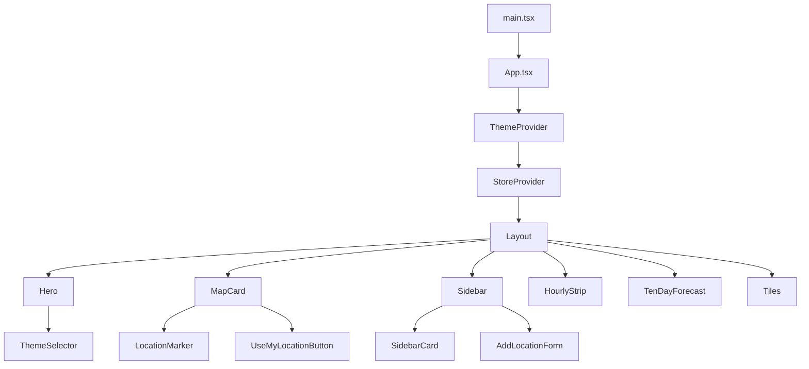
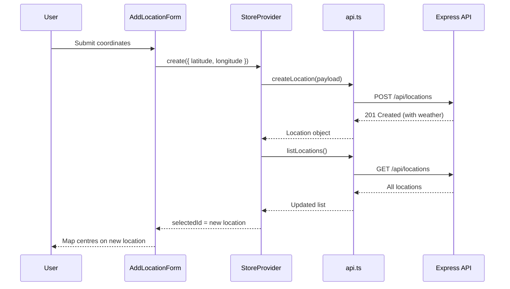

The frontend is a React 18 SPA built with Vite, styled with Tailwind CSS, and featuring an interactive Leaflet map for location management.

## Component Tree



## State Management

State is managed via React Context in `frontend/src/state/store.tsx`. A single `StoreProvider` wraps the app and exposes the `useStore()` hook.

### Store Shape

| Field | Type | Description |
|-------|------|-------------|
| `locations` | `Location[]` | All saved locations |
| `selectedId` | `number \| null` | Currently viewed location |
| `isAdding` | `boolean` | Whether the add form is open |
| `isLoading` | `boolean` | Initial load in progress |
| `refreshingId` | `number \| null` | Location currently being refreshed |
| `error` | `unknown` | Last error |

### Actions

| Action | Description |
|--------|-------------|
| `create(payload)` | Create a location and auto-select it |
| `refresh(id)` | Refresh weather data for a location |
| `remove(id)` | Delete a location |
| `select(id)` | Set the selected location |
| `setAdding(bool)` | Toggle the add-location form |

All actions call the API client, reload the locations list, and log user interactions.

## API Client

`frontend/src/api.ts` provides a fetch-based HTTP client with no external dependencies:

```typescript
listLocations()          // GET  /api/locations
createLocation(payload)  // POST /api/locations
refreshLocation(id)      // POST /api/locations/:id/refresh
deleteLocation(id)       // DELETE /api/locations/:id
fetchAreas()             // GET  /api/areas
logInteraction(event, metadata)  // POST /api/logs
```

All requests use relative paths (`/api/...`), so no CORS configuration is needed — the backend and frontend are served from the same origin.

## Theme System

Multiple built-in themes are available (Arctic Frost, Dark Storm, Sunset Gradient, etc.). The theme system uses:

- `ThemeContext` for global theme state and switching
- Tailwind CSS with dynamic CSS custom properties
- `ThemeSelector` component for user selection

## Key Components

| Component | Responsibility |
|-----------|---------------|
| `Layout` | Main layout grid, responsive breakpoints |
| `Hero` | Header with app title and theme selector |
| `MapCard` | Interactive Leaflet map with location markers |
| `LocationMarker` | Map marker with weather popup |
| `Sidebar` | Location list and add-location form |
| `SidebarCard` | Individual location card with weather summary |
| `AddLocationForm` | Coordinate input for new locations |
| `UseMyLocationButton` | Browser geolocation integration |
| `HourlyStrip` | Horizontal forecast timeline |
| `TenDayForecast` | Multi-day forecast display |
| `Tiles` | Weather metric tiles (humidity, wind, UV, etc.) |
| `WeatherLabel` | Condition badge with icon |
| `FullscreenPortal` | Fullscreen map overlay |

## Data Flow: Creating a Location


