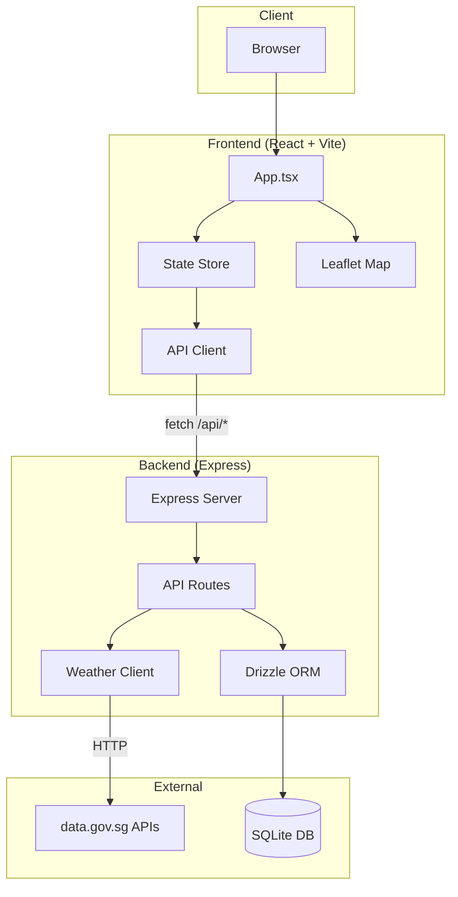
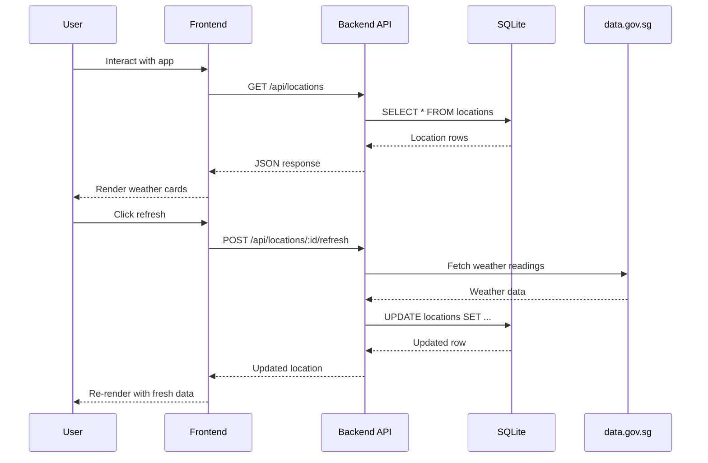

Weather Starter is a full-stack TypeScript monorepo that displays real-time weather data for saved Singapore locations. It combines an Express API backend with a React SPA frontend, backed by SQLite for persistence and Singapore's data.gov.sg APIs for weather data.

## System Architecture



## Tech Stack

| Layer | Technology |
|-------|-----------|
| Frontend | React 18, Vite, Tailwind CSS, Leaflet |
| Backend | Node.js, Express, TypeScript |
| Database | SQLite with WAL mode, Drizzle ORM |
| External Data | Singapore data.gov.sg REST APIs |
| Testing | Vitest, Testing Library, Supertest |
| Dev Tools | Husky, ESLint, Prettier, Portless |

## Monorepo Structure

The project uses npm workspaces with three packages:

```
weather-starter/
├── backend/          # Express API + SQLite
├── frontend/         # React SPA + Vite
├── docs-site/        # Astro Starlight documentation
└── scripts/          # Dev/build utility scripts
```

## Request Flow


